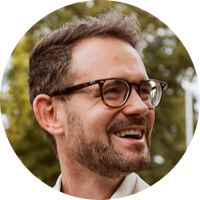
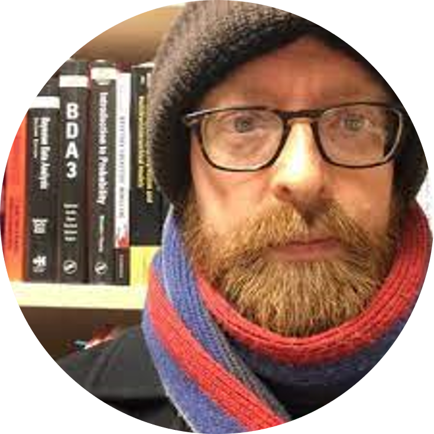
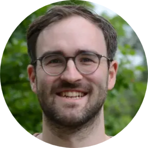
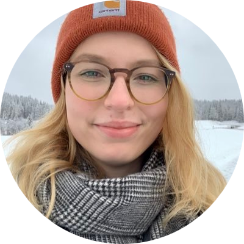
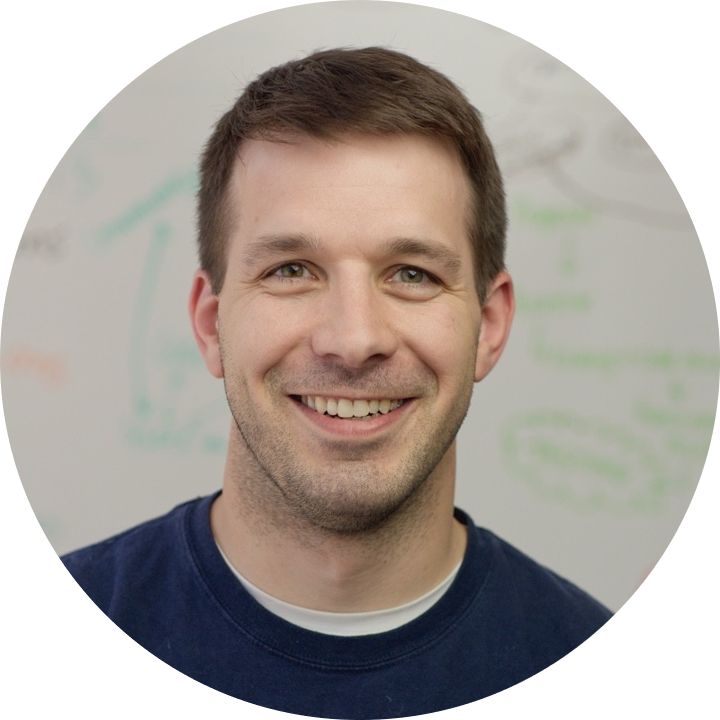

```{=html}
<head>
  <style>
    img {
      float: right;
      margin: 13px;
    }
  </style>
</head
```

All lectures are opened for public registration (see [Join](Join.qmd)).

## Felix Schönbrodt: Replicability crisis

{width="100"} Monday 15 September, 09:45-10:45

Prof. Dr. [Felix Schönbrodt](https://www.osc.uni-muenchen.de/about_us/director/index.html), LMU Open Science Center Managing Director and Professor of Psychology at the LMU, will set the scene and present an overview of the replicability crisis across fields, and an introduction to open research initiatives.

**Materials**: [lecture slides](https://osf.io/x639j/files/4zj2b) and [recording](https://osf.io/x639j/files/v53fh)

## Malika Ihle: Credible research

{width="100"} Monday 15 September, 11:00-11:45

Dr. [Malika Ihle](https://www.osc.uni-muenchen.de/about_us/coordinator/index.html), LMU Open Science Center coordinator, will give an overview of open research practices and will introduce the workshops of this summer school. She will argue that to make your research the most credible and the most likely to replicate, you can engage with preregistration, to increase the reliability of the research, and with a finite set of computing tools, to increase the reproducibility of your workflow.

**Materials**: [lecture slides](https://osf.io/x639j/files/a62xz) and [recording](https://osf.io/x639j/files/75j9y)

## Felix Schönbrodt: Data sharing

{width="100"} Tuesday 16 September, 9:00-09:45\

Prof. Dr. [Felix Schönbrodt](https://www.osc.uni-muenchen.de/about_us/director/index.html) will explain why we should share data and the fundamentals of data sharing practicalities.

**Materials**: [lecture slides](https://osf.io/x639j/files/m3wrf) and [recording](https://osf.io/x639j/files/68cqh)

## Richard McElreath: Science as amateur software development

{width="100"} Wednesday 17 September, 9:00-10:00

Science is one of humanity's greatest inventions. Academia, on the other hand, is not. It is remarkable how successful science has been, given the often chaotic habits of scientists. In contrast to other fields, like say landscaping or software engineering, science as a profession is largely \*unprofessional\*---apprentice scientists are taught less about how to work responsibly than about how to earn promotions. This results in ubiquitous and costly errors. Software development has become indispensable to scientific work.

Prof. Dr. [Richard McElreath](https://www.eva.mpg.de/ecology/staff/richard-mcelreath/), Director of the Department of Human Behavior, Ecology, and Culture at the Max Planck Institute for Evolutionary Anthropology, Leipzig, will playfully ask how software development can become even more useful by transferring some aspects of its professionalism, the day-to-day tracking and back-tracking and testing that is especially part of distributed, open-source software development. Science, after all, aspires to be distributed, open-source knowledge development.

**Materials**: [lecture slides](https://osf.io/x639j/files/euxn7) and [recording](https://osf.io/x639j/files/tp869)

## Felix Schönbrodt: Open access, preprints, postprints

{width="100"} Wednesday 17 September, 10:15-11:45

Prof. Dr. [Felix Schönbrodt](https://www.osc.uni-muenchen.de/about_us/director/index.html) will explain the different shades of Open Access (e.g. green, gold, diamond) and their advantages, and show what different ways there are to make your own publications freely accessible.

**Materials**: [lecture slides](https://osf.io/x639j/files/c2mrb) and [recording](https://osf.io/x639j/files/5rsxb)

## Vera Karlbauer & Jonas Hagenberg: Readable code

{width="100"} {width="100"}
Thursday 18 September, 09:00-09:45

Many research questions require code to be answered. Clear, understandable and maintainable code is key to reduce analysis errors and improve reproducibility. [Vera Karlbauer](https://www.psych.mpg.de/person/125319), PhD student at the Max Planck Institute of Psychiatry (MPIP), and [Jonas Hagenberg](https://www.helmholtz.ai/applied-ai/ai-consultancy-teams/piraud-team/), AI consultant at Helmholtz, will give an overview which concepts work for data analysis scripts and share specific recommendations and examples for clean code that are applicable across scientific disciplines. The lecture introduces key strategies such as following a style guide, code reuse, unified project structures and code review.

**Materials**: [lecture slides](https://osf.io/x639j/files/sgwqc) and [recording](https://osf.io/x639j/files/mrg5z)

## Tim Errington: Assessing research replicablity

{width="100"} Thursday 18 September, 15:30-16:15

Replicability is an important feature of scientific research, but aspects of contemporary research culture, such as an emphasis on novelty, can make replicability seem less important than it should be. The Reproducibility Project: Cancer Biology was set up to provide evidence about the replicability of preclinical research in cancer biology by repeating selected experiments from high-impact papers. A total of 50 experiments from 23 papers were repeated, generating data about the replicability of a total of 158 effects.

Dr. [Tim Errington](https://osf.io/alh38/), Senior Director of Research at Center for Open Science, will present and discuss the results and implications of this large replication project.

**Materials**: [lecture slides](https://osf.io/x639j/files/5m9j8) and [recording](https://osf.io/x639j/files/v8dqb)

