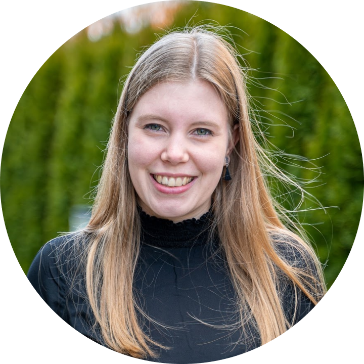
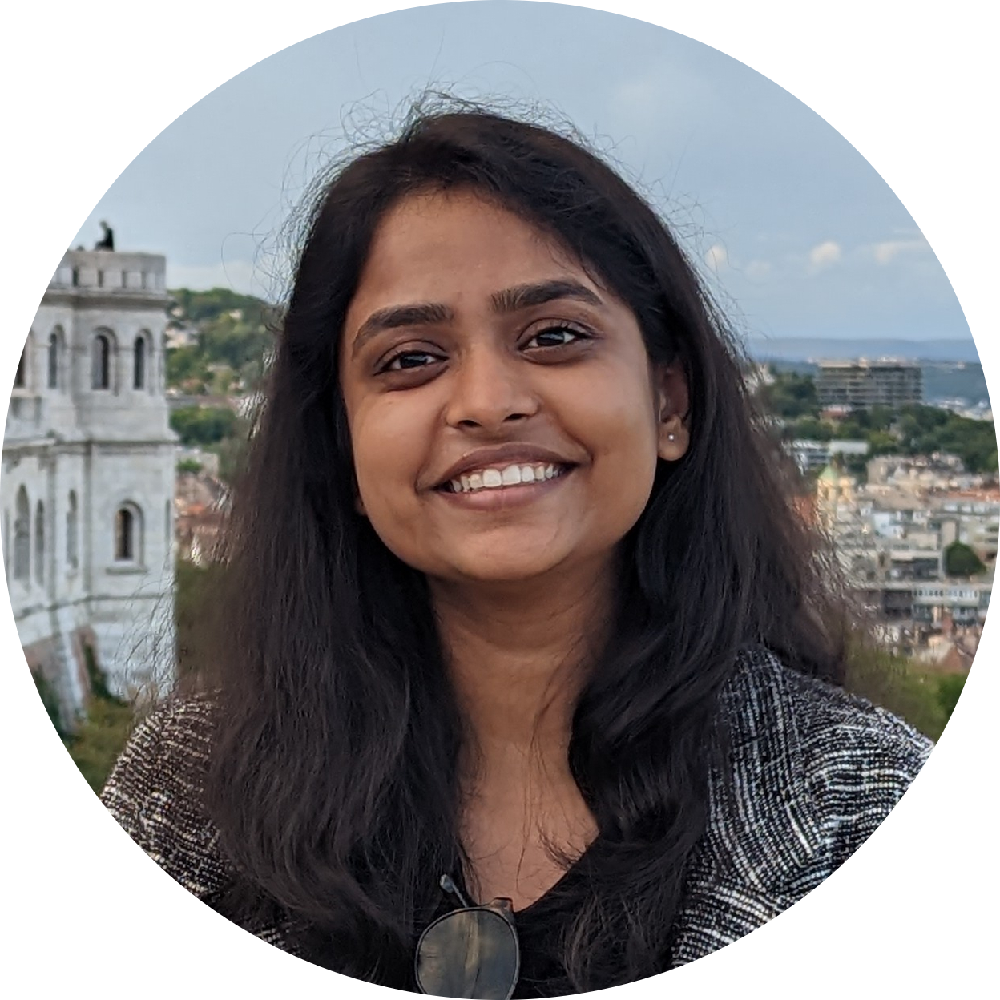
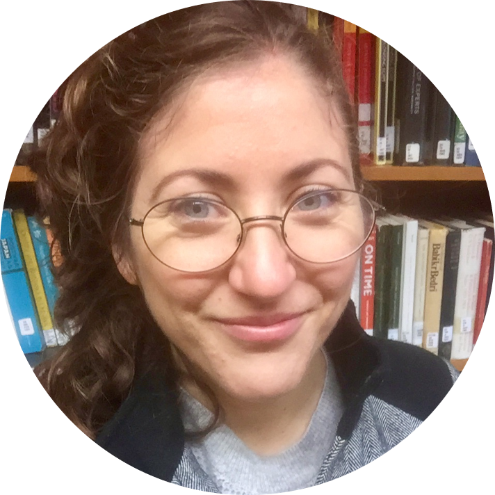

```{=html}
<head>
  <style>
    img {
      float: right;
      margin: 13px;
    }
  </style>
</head
```

These [workshops](#workshops) and [interactive sessions](#interactivesessions) are for selected applicants of Track 1 only (see [Join](Join.qmd)).

# Workshops {#workshops}

## Introduction to R

[Sarah von Grebmer zu Wolfsthurn](https://www.osc.uni-muenchen.de/members/individual_members/lmu-members/wolfsthurn/index.html), [Edouard Bonneville](https://www.osc.uni-muenchen.de/members/individual_members/lmu-members/bonneville/index.html), [Sara Lil Middleton](https://www.osc.uni-muenchen.de/members/individual_members/lmu-members/lil/index.html)\
{width="100"} {width="100"} {width="100"} Monday 7 September, 14:30-17:30

This workshop introduces the fundamentals of the R programming language with a track for total novices and a track for researchers already familiar with R. Through hands-on exercises, you will learn how to navigate RStudio, import and manipulate data, and create basic visualizations. By the end of the session, participants will have the skills and confidence to use R for their own research projects.

The self-paced tutorial for this workshop can be found here: <a href="https://lmu-osc.github.io/introduction-to-R/" target="_blank">https://lmu-osc.github.io/introduction-to-R/</a>

## FAIR research data management

[Reema Gupta](https://www.osc.uni-muenchen.de/members/individual_members/fellows/gupta/index.html), [Laura Meier](https://www.ub.uni-muenchen.de/ueber-die-ub/kontakt/personen/meier-l/index.html), [Sara Lil Middleton](https://www.osc.uni-muenchen.de/members/individual_members/lmu-members/lil/index.html)\
{width="100"} {width="100"} {width="100"} Tuesday 8 September, 10:00-11:45

This session is centered around the FAIR principles — Findability, Accessibility, Interoperability, and Reusability — and their practical application in managing your research data efficiently. Learn to manage your data in a way that enhances its value and accessibility for the wider research community.

Appreciation of adequate data management mostly occurs very late, e.g., when looking into someone else’s data folder. We are here artificially advancing this experience: You will investigate a publicly available dataset and complete exercises regarding data organization, documentation, and publication aspects.

The material for this workshop can be found here:
<a href="https://lmu-osc.github.io/FAIR-Data-Management/" target="_blank">https://lmu-osc.github.io/FAIR-Data-Management/</a>

**EDIT**The workshop slides can be found here: <a href="https://osf.io/x639j/files/qjtec/" target="_blank">https://osf.io/</a>

## Preregistration

[Malika Ihle](https://www.osc.uni-muenchen.de/about_us/coordinator/index.html)\
{width="100"} Tuesday 8 September, 13:15-15:15

In this workshop, we will review what detailed information preregistrations and registered reports should contain. We will also collectively discuss the benefits and disadvantages of embracing such practices, as well as possible fear and concerns, in a structured academic debate. Finally, we will look into how to preregister in practice on the Open Science Framework, and practice the level of precision needed in a preregistration by peer-reviewing snippets.

**EDIT** The workshop slides can be found here: <a href="https://osf.io/x639j/files/8hykq" target="_blank">https://osf.io/</a>

## Simulations of data and data analyses in R

[Malika Ihle](https://www.osc.uni-muenchen.de/about_us/coordinator/index.html)\
{width="100"} Tuesday 8 September, 15:30-17:30

You will be guided through the What, Why, and How of simulations of data and data analyses. Specifically, we will cover the concept of power analyses for simple tests, how to check for false positive rates, and how simulations can help with preparing a preregistration.

We will follow this self-paced tutorial:
<a href="https://lmu-osc.github.io/Introduction-Simulations-in-R/" target="_blank">https://lmu-osc.github.io/Introduction-Simulations-in-R/</a>

## Research Data Management (RDM) plans

[Laura Meier](https://www.ub.uni-muenchen.de/ueber-die-ub/kontakt/personen/meier-l/index.html), [Reema Gupta](https://www.osc.uni-muenchen.de/members/individual_members/fellows/gupta/index.html), [Sara Lil Middleton](https://www.osc.uni-muenchen.de/members/individual_members/lmu-members/lil/index.html)\
{width="100"} {width="100"} {width="100"} Wednesday 9 September, 13:15-14:15

The planning of a research project and the management of one’s own data bring many advantages in everyday research. Laura Meier, from the RDM information team of the LMU Munich University Library, will present what to look for when creating a data management plan and how web-based tools such as the Research Data Management Organiser (RDMO) can be used to make research data management easier.

The material for this workshop can be found here: 
<a href="https://lmu-osc.github.io/FAIR-Data-Management/dmp.html" target="_blank">https://lmu-osc.github.io/FAIR-Data-Management/dmp.html</a>

## Version control in RStudio with Git

[Malika Ihle](https://www.osc.uni-muenchen.de/about_us/coordinator/index.html), [Reema Gupta](https://www.osc.uni-muenchen.de/members/individual_members/fellows/gupta/index.html), [Pat Callahan](https://www.osc.uni-muenchen.de/members/individual_members/fellows/callahan/index.html)\
 {width="100"} {width="100"} Wednesday 9 September, 14:30-17:30

In this workshop, you will learn the basic concept of version control using RStudio as one of many possible GUI interfaces that can interact with Git. You will learn how to use version control for your own workflow (Git within RStudio with backup online on GitHub) and for collaborative coding (fork, clone, pull requests on Github).

The tutorials can be found at:
<a href="https://lmu-osc.github.io/Introduction-RStudio-Git-GitHub/" target="_blank">https://lmu-osc.github.io/Introduction-RStudio-Git-GitHub/</a> and 
<a href="https://lmu-osc.github.io/Collaborative-RStudio-GitHub/" target="_blank">https://lmu-osc.github.io/Collaborative-RStudio-GitHub/</a>

## Quarto

[Pat Callahan](https://www.osc.uni-muenchen.de/members/individual_members/fellows/callahan/index.html), [Sarah von Grebmer](https://www.osc.uni-muenchen.de/members/individual_members/lmu-members/wolfsthurn/index.html)\
{width="100"} Thursday 10 September, 10:00-11:45

Quarto makes transparent and reproducible data analysis simple and fun. In a nutshell, Quarto lets you mix text written in markdown with chunks of executable code written in, e.g., R or Python. You can use it for interactive notebooks, and export to a large number of formats including HTML, PDF/LaTeX, Microsoft Word or PowerPoint, or even interactive websites. In this workshop, we cover the fundamentals, including the markdown syntax, code chunks and inline code, and the output formats available. We also go over citations, cross-referencing, and templating, which ultimately allow you to write academic papers entirely in Quarto.

The tutorial for this workshop can be found here:
<a href="https://lmu-osc.github.io/introduction-to-Quarto/" target="_blank">https://lmu-osc.github.io/introduction-to-Quarto/</a>

## Reproducible R environment and code publishing

[Pat Callahan](https://www.osc.uni-muenchen.de/members/individual_members/fellows/callahan/index.html), [Reema Gupta](https://www.osc.uni-muenchen.de/members/individual_members/fellows/gupta/index.html)\

{width="100"} Thursday 10 September, 13:15-16:15

This session will wrap up all the computing skill workshops of this week by creating a minimal example of a reproducible executable manuscript containing analyses and results that can be made available upon submission of a manuscript.

Workshop participants will clone a GitHub repository containing data, create an example manuscript in Quarto (with formatted text, figures, table, references), using R and Zotero, make sure the computational environment is reproducible using renv and binder, add appropriate documentation (e.g. README file) and licence to allow reuse, and select an appropriate platform to publish projects with a DOI.

The tutorials for this workshop can be found here:
<a href="https://lmu-osc.github.io/introduction-to-renv/" target="_blank">https://lmu-osc.github.io/introduction-to-renv/</a>
and here: <a href="https://lmu-osc.github.io/code-publishing/" target="_blank">https://lmu-osc.github.io/code-publishing/</a>

# Interactive sessions {#interactivesessions}

## Welcome & Logistics

**OSC Team**\
Monday 7 September, 9:15-9:45

We will welcome online and in-person participants to the summer school, introduce the OSC team, and cover the logistics. We will also present a brief overview of the LMU Open Science Center's activities.

## Hybrid networking

**OSC Team**\
Monday 7 September, 13:15-14:15

In-person and online participants will get to know each other in small groups, each with a 360 degrees camera-microphone.

## Dinner

Thursday 10 September, 18:00

Dinner among attendees and instructors will be at own cost and upon separate registration.

## Trainees' projects

**OSC Team**\
Friday 11 September, 10:15-11:45

In this session, you have the opportunity to work on your own projects or workflows and receive tailored guidance from our instructors and facilitators. Whether you're facing challenges with your code, or one of the topics covered during this summer school, this is the time to finish up exercises from the previous workshops or start up new workflows for your own scientific workflows. 

## Q&A

**OSC Team**\
Friday 11 September, 13:15-14:15

During this session, you will have the opportunity to ask questions about your own projects, for example about the topics of the summer school, any challenges that you are facing or the implementation of specific workflow steps. This session provides a space for personalized support, troubleshooting and solution-focused group discussions.

## Where to go from here?

[Sarah von Grebmer zu Wolfsthurn](https://www.osc.uni-muenchen.de/members/individual_members/lmu-members/wolfsthurn/index.html)\
{width="100"} Friday 11 September, 14:30-16:00

In this facilitated discussion, we will reflect on how you can plan to integrate parts of this course into your research and the strategies you can put in place to best support yourself in reaching your goals, following the "Ten simple rules for implementing open and reproducible research practices after attending a training course" (<a href="https://doi.org/10.1371/journal.pcbi.1010750" target="_blank">https://doi.org/10.1371/journal.pcbi.1010750</a>).
