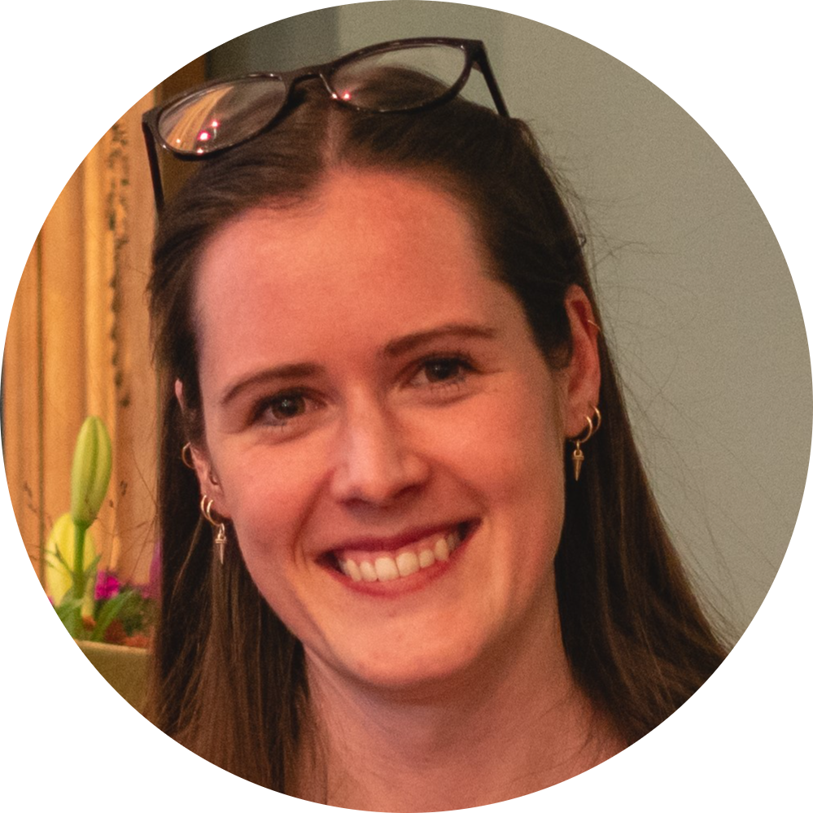
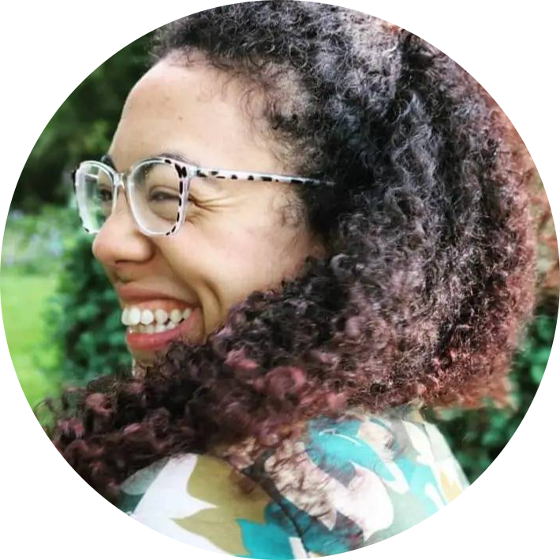
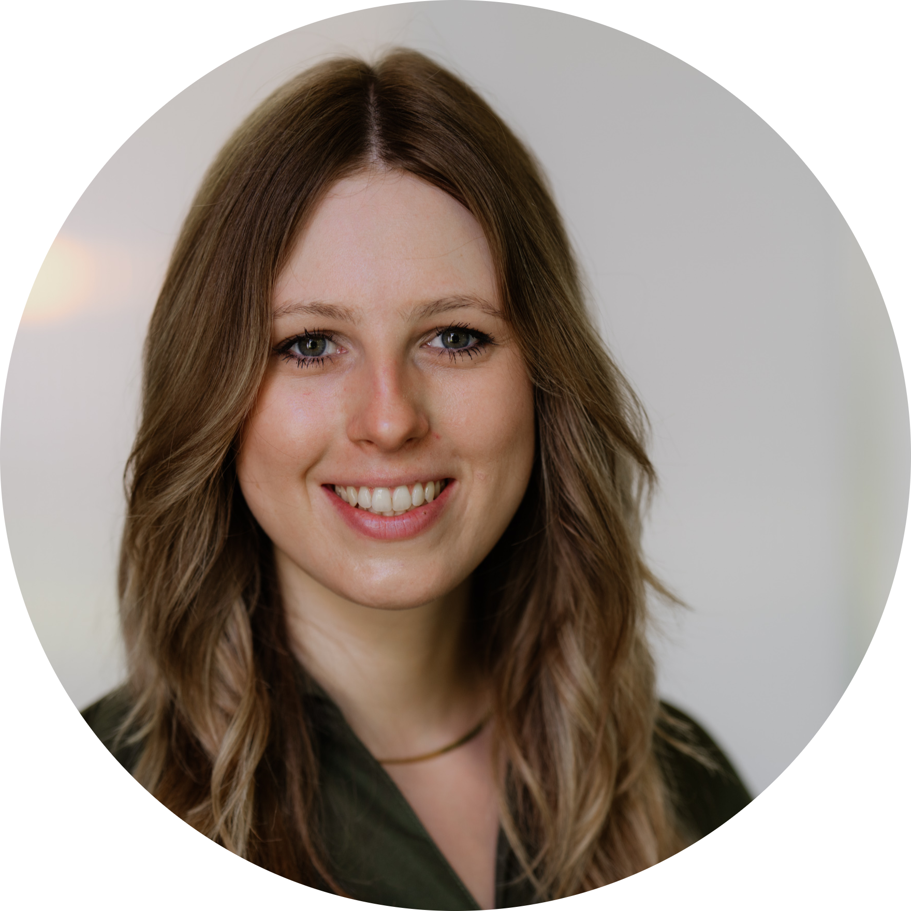

```{=html}
<head>
  <style>
    img {
      float: right;
      margin: 13px;
    }
  </style>
</head
```

These workshops are for selected applicants of Track 2 only (see [Join](Join.qmd)).

## Teaching Open Science: Core didactic principles

[Sarah von Grebmer zu Wolfsthurn](https://www.osc.uni-muenchen.de/members/individual_members/lmu-members/wolfsthurn/index.html)\
{width="100"} Monday 14 September, 09:00-10:30

Are you interested in introducing your peers, students, or lab group to Open Science, or thinking about offering engaging workshops on the topic? Or are you simply interested in how to make your teaching better? This interactive, evidence-based workshop provides an overview of the core didactic principles to help you effectively teach Open Science to researchers and students. Participants will learn about the foundations of successful learning, Bloom's taxonomy, how to formulate learning goals and practice these skills in group-based activities. No prior teaching experience is required — just curiosity and a desire to apply these didactic skills in the context of Open Science.


## Concept planning for Open Science workshops (and courses)
[Sarah von Grebmer zu Wolfsthurn](https://www.osc.uni-muenchen.de/members/individual_members/lmu-members/wolfsthurn/index.html)\
{width="100"} Monday 14 September, 10:45-11:45

During this session, participants will learn the fundamentals of planning and designing engaging workshops or courses on Open Science, how to enhance the motivation to learn and actively engage during those workshops, how to activate your learner's prior knowledge about Open Science and how to structure an individual lesson on an Open Science topic to enhance the learning process. 

## Creating a supportive learning environment

[Sarah von Grebmer zu Wolfsthurn](https://www.osc.uni-muenchen.de/members/individual_members/lmu-members/wolfsthurn/index.html)\
{width="100"} Monday 14 September, 13:15-14:15

The learning environment is a key element in any learning process. During this session, participant will learn how to create a supportive learning environment through (body) language, different engagement methods, setting interaction rules, through constructive and thought-through feedback and my fostering a growth mindset in your learners. 

## Activating and motivating your audience

[Sophie Renard](https://www.osc.uni-muenchen.de/members/individual_members/lmu-members/wolfsthurn/index.html)\
{width="100"} Monday 14 September, 14:30-15:45

During this session led by Sophie Renard from Profil, the organisation XX at LMU; a special focus is placed on  exploring and implementing activation techniques that boost motivation and attention in classroom and workshop settings. You will learn how to tailor your activation activities to your learning goals and your audience to meet the needs of various learners, regardless of their prior knowledge or background in Open Science.
You will practise various activation tools in a group-based interactive setting while developing a feel for what is right for you as an instructor and what could be implemented in the Open Science context.


**EDIT** The workshop slides can be found here: <a href="https://osf.io/tkwqs/files/h8xb5" target="_blank">https://osf.io/</a>


## Design your own Open Science workshop: Part I

[Sara Lil Middleton](https://www.osc.uni-muenchen.de/members/individual_members/lmu-members/lil/index.html),
[Sarah von Grebmer](https://www.osc.uni-muenchen.de/members/individual_members/lmu-members/wolfsthurn/index.html)\
{width="100"}
{width="100"} Monday 14 September, 16:00-17:30

Pooling all your skills, methods, techniques and tools from the previous workshops, in this session you will start designing your own workshop, lesson or course on an Open Science topic of your choice. Through guidance and feedback from the instructors as well as hands-on guidelines and templates, you are encouraged to create a first draft for your own workshop to teach after the summer school. 

## Leadership in Open Science

[Franziska Schrade](https://www.lmu.de/psy/de/center-for-leadership-and-people-management/),
[Sarah von Grebmer zu Wolfsthurn](https://www.osc.uni-muenchen.de/members/individual_members/lmu-members/wolfsthurn/index.html)\
{width="100"} {width="100"} Friday 19 September, 16:30-17:30

Are you keen on implementing Open Science and would like to learn more about the surrounding issues and potential challenges that come with it? Do you want to be prepared to be an advocate for something that is currently still “outside the norm” and sometimes met with skepticism? In this workshop led by [Franziska Schrade](https://www.lmu.de/psy/de/personen/kontaktseite/franziska-schrade-36160dbf.html) from the LMU [Center for Leadership and People Management](https://www.lmu.de/psy/de/center-for-leadership-and-people-management/), we will interactively discuss issues connected to Open Science and challenges around its implementation. At the end of this workshop, you will be able to:

-   Critically assess the principles and challenges of Open Science in academic practice and identify common barriers to implementing open research practices such as accessibility, diversity, and citation politics;
-   Develop the skills and confidence to lead, moderate, and advocate for open science initiatives, including workshops and lectures.

The workshop slides can be found here: <a href="https://osf.io/tkwqs/files/zqj4s" target="_blank">https://osf.io/</a>


## Design your own Open Science workshop: Part II

[Sara Lil Middleton](https://www.osc.uni-muenchen.de/members/individual_members/lmu-members/lil/index.html),
[Sarah von Grebmer](https://www.osc.uni-muenchen.de/members/individual_members/lmu-members/wolfsthurn/index.html)\

{width="100"}
{width="100"} Tuesday 15 September, 16:00-17:30

Equipped with new skills about leadership, accessibility, in this session you will continue designing your workshop, lesson or course on Open Science from the previous day through feedback from the instructors and your peers. 
At the end of this session, you will have a ready-to-go concept for your Open Science teaching activities after the summer school. 

