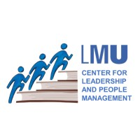

{width=60% alt="photo of the philologicum library building, with a long middle part with a glass wall flancked by stone building parts. In front of the building, there is a profile outline of an anonymous group of people, one of them holding a laptop facing us with other people on the screen. An arrow points to the group of people and laptop, labelled 'this could be you!'" fig-align="center"}

The [LMU Open Science Center](https://www.osc.uni-muenchen.de/index.html){target="_blank"} organises its 5^th^ **hybrid summer school**. Participants can choose to attend in-person at the Philologicum Library, **Ludwigstraße 25, 80539 München, Germany**, or online, on **Zoom**.

This year's iteration has two tracks to provide participants with two complementary sets of skills.

## Track 1: Open Science knowledge and skills

In this track, early career researchers who are Open Science novices learn to make their research more **transparent**, **reproducible** and **credible** in the eyes of their peers, the public, and funding agencies. This track consists of [public lectures](Lectures.qmd) accessible to anyone as well as hands-on practical [workshops](Track1_Workshops.qmd) for selected applicants. It extends from **09:00** on **Monday 07.09.2026** to **16:00** on **Friday 11.09.2026**. See the [programme of Track 1](Track1_Programme.qmd) for more details. 

Participants of this track learn how to:

-   Specify research design and set up statistical plans in advance of collecting data to prevent biases in analyses, with the help of **preregistration and data simulation**

-   Create **computationally reproducible workflows** to be more efficient and spot mistakes in data wrangling or analyses, through programming with version controlled scripts

-   **Prepare and share data and code** in connection with manuscripts by applying the Findable, Accessible, Interoperable, Reusable principles, and using adequate repositories and licenses to accumulate credit and citations

## Track 2: Open Science instructor training

In this track, early career researchers or research support staff interested in becoming Open Science instructors develop essential **pedagogical skills to promote Open Science through teaching** - no prior teaching experience is required. This track consists of hands-on [workshops](Track2_Workshops) as well as guided sessions to design your own workshop on an open science topic of your choice. Track 2 takes place from **09:00** on **Monday 14.09.2026** to **17:00** on **Tuesday 15.09.2026**. See  the [programme of Track 2](Track2_Programme.qmd) for more details.

Participants of this track will:

-   Familiarize themselves and apply **basic didactic techniques** to effectively convey open science topics to learners in a supportive learning environment

-   Learn how to **design and deliver open science workshops** to diverse audiences and across different settings

-   Implement techniques to **foster learners' motivation and engagement** with open science topics

-   Develop skills to **advocate for open science**, to lead research groups and discussions around open science, and to analyse the potential challenges and issues around the implementation of open science practices

-   **Design their own workshop** on an open science topic of their choice by applying the newly acquired skills and present the concept to other participants for future delivery

After joining this track, participants are strongly encouraged to **deliver the workshop** they designed with practical and logistical support of the LMU Open Science Center.

## Funding & Partners

The organisers of this summer school, LMU Open Science Center train-the-trainer program coordinator [Dr. Sarah von Grebmer zu Wolfsthurn](https://www.osc.uni-muenchen.de/members/individual_members/lmu-members/wolfsthurn/index.html){target="_blank"} and LMU Open Science Center coordinator [Dr. Malika Ihle](https://www.osc.uni-muenchen.de/about_us/coordinator/index.html){target="_blank"}, are funded by the LMU Central Study Fund and the Volkswagen Foundation Pioneer Project grant. The University Library of LMU Munich provides in-kind support. Materials were also generated in collaboration with the [LMU Center for Leadership and People Management](https://www.lmu.de/psy/en/center-for-leadership-and-people-management/) and [PROFiL](https://www.lmu.de/profil/de/) - "Professionell in der Lehre".

{fig-alt="OSC, LMU and UB logos" fig-align="center" width="400"}
{fig-alt="Profil logo" fig-align="center" width="150"}
{fig-alt="CLPM logo" fig-align="center" width="150"}
