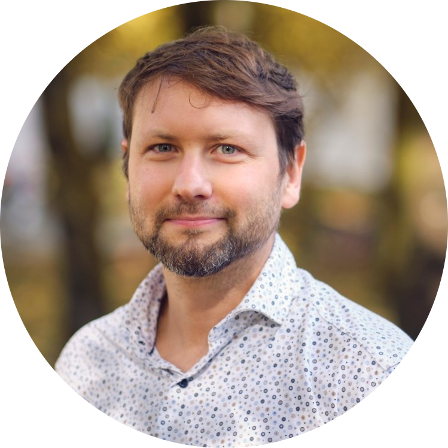
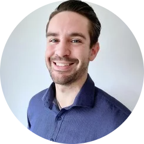

```{=html}
<head>
  <style>
    img {
      float: right;
      margin: 13px;
    }
  </style>
</head
```

All lectures are opened for public registration (see [Join](join.qmd)). All times are CEST.

## Alexander Wuttke: Replicability crisis

{width="100"} Monday 7 September, 09:45-10:45

Prof. Dr. [Alexander Wuttke](https://www.gsi.uni-muenchen.de/personen/professoren/wuttke/index.html), Professor of Digitalisation and Political Behaviour at the LMU, will set the scene and present an overview of the replicability crisis across fields, and an introduction to open research initiatives.

<!-- EDIT **Materials**: [lecture slides](https://osf.io/x639j/files/4zj2b) and [recording](https://osf.io/x639j/files/v53fh) -->

## Malika Ihle: Credible research

{width="100"} Monday 7 September, 11:00-11:45

Dr. [Malika Ihle](https://www.osc.lmu.de/people/people/malika-ihle.html), LMU Open Science Center coordinator, will give an overview of open research practices and will introduce the workshops of this summer school. She will argue that to make your research the most credible and the most likely to replicate, you can engage with preregistration, to increase the reliability of the research, and with a finite set of computing tools, to increase the reproducibility of your workflow.

<!-- EDIT **Materials**: [lecture slides](https://osf.io/x639j/files/a62xz) and [recording](https://osf.io/x639j/files/75j9y) -->

## Reema Gupta: Data sharing

{width="100"} Tuesday 8 September, 9:00-09:45\

[Reema Gupta](https://www.osc.lmu.de/people/people/reema-gupta.html) from the LMU Open Science Center will make the case for sharing research data as a cornerstone of good scientific practice, introduce the FAIR principles (Findable, Accessible, Interoperable, Reusable) as a practical framework across disciplines, and surface common tensions researchers face, such as balancing openness with legitimate restrictions, recognizing both data collection and data reuse, and handling reanalysis constructively, inviting attendees to reflect on how these trade-offs play out in their own field and practice.

<!-- EDIT **Materials**: [lecture slides](https://osf.io/x639j/files/m3wrf) and [recording](https://osf.io/x639j/files/68cqh) -->

## Richard McElreath: A Guerilla approach to scientific workflows

{width="100"} Wednesday 9 September, 9:00-10:00

Prof. Dr. [Richard McElreath](https://www.eva.mpg.de/ecology/staff/richard-mcelreath/), Director of the Department of Human Behavior, Ecology, and Culture at the Max Planck Institute for Evolutionary Anthropology, Leipzig, will take inspiration from guerilla warfare, and introduce a framework for managing scientific research that addresses the complexity of research while advancing goals of transparency and reliability. Real science is complex, and there is no single scientific method. It is a chaotic network of theories, data, models, graphs, comparisons, summaries, and narratives. A flaw in any part can ruin everything. How can small teams of researchers challenge this complexity and emerge victorious? More statistical training is not enough. More resources is not enough. Lawrence of Arabia once said, "Guerrilla warfare is more intellectual than a bayonet charge." And this is how we too will proceed. Instead of confronting the complexity directly, with more money and more people and more data and more meta-analyses, we must develop a SCIENTIFIC WORKFLOW that subdivides, analyzes, and transparently justifies our individual research projects. The tools to do this already exist, and individual researchers can become scientific guerillas today to improve their chances of victory.

<!-- EDIT **Materials**: [lecture slides](https://osf.io/x639j/files/euxn7) and [recording](https://osf.io/x639j/files/tp869) -->

## Sarah von Grebmer: Open access, preprints, postprints

{width="100"} Wednesday 9 September, 10:15-11:45

Dr. [Sarah von Grebmer](https://www.osc.lmu.de/people/people/sarah-von-grebmer-zu-wolfsthurn.html) will discuss the current scientific publishing system, explore the different shades of Open Access (e.g. green, gold, diamond) and their advantages, and show what different ways there are to make your own publications freely accessible for a broader audience. 

<!-- EDIT **Materials**: [lecture slides](https://osf.io/x639j/files/c2mrb) and [recording](https://osf.io/x639j/files/5rsxb) -->

## Jonas Hagenberg: Readable code

{width="100"}
Thursday 10 September, 09:00-09:45

Many research questions require code to be answered. Clear, understandable and maintainable code is key to reduce analysis errors and improve reproducibility. [Jonas Hagenberg](https://www.helmholtz.ai/applied-ai/ai-consultancy-teams/piraud-team/), AI consultant at Helmholtz, will give an overview which concepts work for data analysis scripts and share specific recommendations and examples for clean code that are applicable across scientific disciplines. The lecture introduces key strategies such as following a style guide, code reuse, unified project structures and (automatic) code review.

<!-- EDIT **Materials**: [lecture slides](https://osf.io/x639j/files/sgwqc) and [recording](https://osf.io/x639j/files/mrg5z) -->

## Tim Errington: Assessing research repeatability

{width="100"} Thursday 10 September, 16:30-17:30

Repeatability is an important feature of scientific research, yet certain aspects of the current research culture, such as an emphasis on novelty, can make repeatability seem less important than it should be. In this lecture, [Tim Errington](https://www.cos.io/team/tim-errington), Senior Director of Resarch at the Center for Open Science, will present findings and implications from large-scale efforts to repeat findings across the social-behavioral sciences and preclinical biomedicine.


<!-- EDIT **Materials**: [lecture slides](https://osf.io/x639j/files/5m9j8) and [recording](https://osf.io/x639j/files/v8dqb) -->


## Danny Maupin: Open Science: The tension between equity and exploitation 

{width="100"} Friday 11 September, 09:00-10:00

Open Science principles have primarily been aimed at increasing equity by providing data and articles free of charge to interested users and integrity whereby the sharing of data sets, code, and registering methodologies can provide transparency. In the age of artificial intelligence this openness has ironically led to a surge of new problematic and unethical behaviours.  This presentation evidences this behaviour, as well as the consequences and potential solutions. 

[Danny Maupin](https://www.surrey.ac.uk/people/danny-maupin) is a Research Fellow at the University of Surrey, whose work focuses on the effects of AI on Open Science and research integrity. 

<!-- EDIT **Materials**: [lecture slides](https://osf.io/x639j/files/5m9j8) and [recording](https://osf.io/x639j/files/v8dqb) -->
