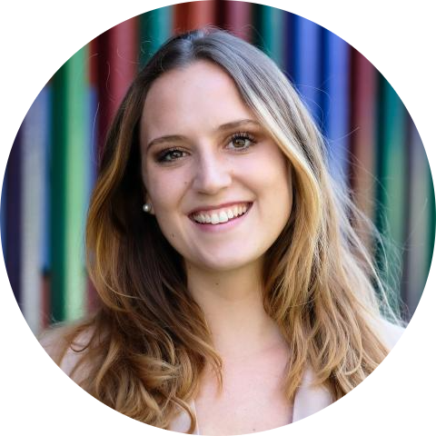
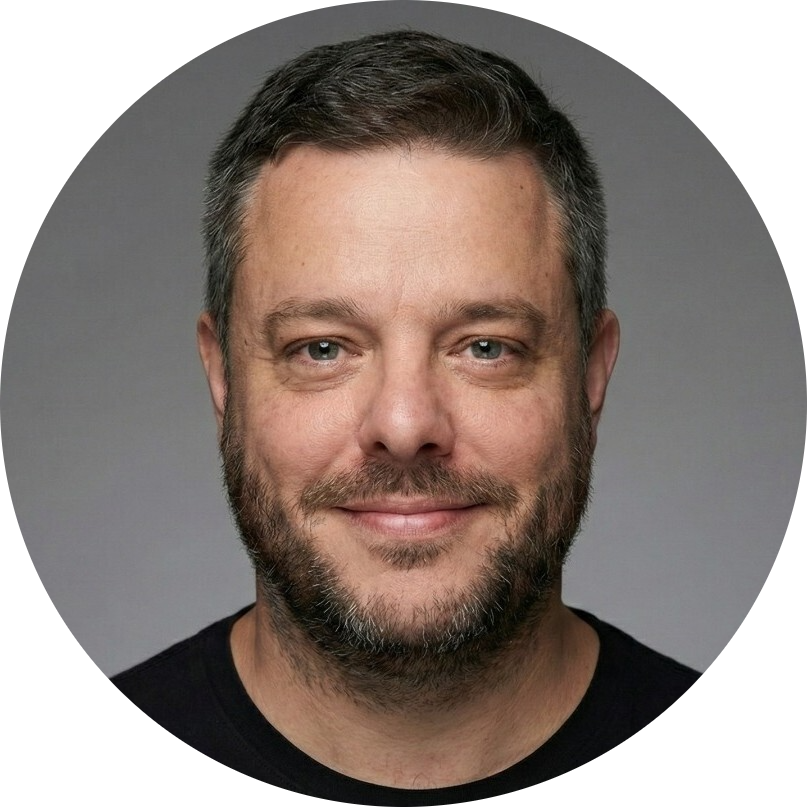

```{=html}
<head>
  <style>
    img {
      float: right;
      margin: 13px;
    }
  </style>
</head
```

These [workshops](#track2workshops) are for selected applicants of Track 2 only (see [Join](join.qmd)).

# Track 2 workshops {#track2workshops}

## Teaching Open Science: Core didactic principles

[Sarah von Grebmer zu Wolfsthurn](https://www.osc.lmu.de/people/people/sarah-von-grebmer-zu-wolfsthurn.html)\
{width="100"} Monday 14 September, 09:00-10:30

Are you interested in introducing your peers, students, or lab group to open research, or thinking about offering engaging workshops on the topic? Or are you simply interested in how to make your teaching on open research topics better? This interactive, evidence-based workshop provides an overview of the core didactic principles to help you effectively teach open research to researchers and students. You will learn about the foundations of successful learning, Bloom's taxonomy, how to formulate learning goals and practice these skills in group-based activities. No prior teaching experience is required — just curiosity and a desire to apply these didactic skills in the context of open research.

<!-- ADD TTT GITHUB WEBSITE The workshop slides can be found here: <a href="https://xx/" target="_blank">https://xxxx/</a> -->

## Concept planning for Open Science workshops (and courses)
[Sarah von Grebmer zu Wolfsthurn](https://www.osc.lmu.de/people/people/sarah-von-grebmer-zu-wolfsthurn.html)\
{width="100"} Monday 14 September, 10:45-11:45

During this session, you will learn the fundamentals of planning and designing engaging workshops or courses on open science, how to enhance the motivation to learn and actively engage learners during, how to activate your learner's prior knowledge about open science and how to structure an individual lesson on an open science topic to enhance the learning process. 

<!-- ADD TTT GITHUB WEBSITE The workshop slides can be found here: <a href="https://xx/" target="_blank">https://xxxx/</a> -->

## Creating a supportive learning environment

[Sarah von Grebmer zu Wolfsthurn](https://www.osc.lmu.de/people/people/sarah-von-grebmer-zu-wolfsthurn.html)\
{width="100"} Monday 14 September, 13:15-14:15

The learning environment is a key element in any learning process. During this session, you will learn how to create a supportive learning environment through (body) language, different engagement methods, interaction rules, constructive and thought-through feedback and by fostering a growth mindset in your learners to engage with open research content. 

<!-- ADD TTT GITHUB WEBSITE The workshop slides can be found here: <a href="https://xx/" target="_blank">https://xxxx/</a> -->

## Beyond the lecture: Activating learners in academic teaching

[Sophie Renard](https://www.lmu.de/profil/de/profil-ueber-uns/personen-und-beratungsfachgebiete/kontaktseite/sophie-renard-3cedfec5.html)\
{width="100"} Monday 14 September, 14:30-15:45

In this interactive session led by [Sophie Renard](https://www.lmu.de/profil/de/profil-ueber-uns/personen-und-beratungsfachgebiete/kontaktseite/sophie-renard-3cedfec5.html) from [PROFiL](https://www.lmu.de/profil/de/), participants will explore how short activation methods can support attention, engagement, and learning processes in higher education teaching and when teaching about Open Science. Especially in longer, input-heavy, or hybrid learning settings, small interactive interventions can help learners stay focused, cognitively engaged, and actively involved. Participants will experience and reflect on a range of low-threshold activation methods that can easily be integrated into different teaching formats with minimal preparation effort. The workshop combines short theoretical inputs with practical exercises, peer exchange, and reflection activities, enabling participants to directly connect the methods to their own teaching practice in the context of Open Science.


<!-- **EDIT** The workshop slides can be found here: <a href="https://osf.io/tkwqs/files/h8xb5" target="_blank">https://osf.io/</a> -->


## Design your own Open Science workshop: Part I

[Sarah von Grebmer zu Wolfsthurn](https://www.osc.lmu.de/people/people/sarah-von-grebmer-zu-wolfsthurn.html),
[Sara Lil Middleton](https://www.osc.lmu.de/people/people/sara-lil-middleton.html)\
{width="100"} {width="100"} Monday 14 September, 16:00-17:30

Pooling all your skills, methods, techniques and tools from the previous workshops, in this session you will start designing your own workshop, lesson or talk on an open science topic of your choice. Through guidance and feedback from the instructors as well as hands-on guidelines and ready-to-use templates, you create a first draft for your own workshop to teach after the summer school. 

<!-- ADD TTT GITHUB WEBSITE The workshop slides can be found here: <a href="https://xx/" target="_blank">https://xxxx/</a> -->

## Leadership in Open Science: Skills, values, and culture

[Sara Lil Middleton](https://www.osc.lmu.de/people/people/sara-lil-middleton.html), [Flavio Azevedo](https://flavioazevedo.com/about)\
{width="100"} {width="100"} Tuesday 15 September, 09:00-10:30

What does it mean to be a leader in open science? What makes an effective leader? During this interactive session we will examine the key leadership skills and explore how values shape styles of leadership, influence research and learning culture and ways of working. In this session, we will be joined by [Flavio Azevedo](https://flavioazevedo.com/about), assistant professor in Interdisciplinary Social Sciences at Utrecht University and Director of [FORRT](https://forrt.org/) (Framework for Open and Reproducible Research Training), who will share insights into his leadership journey within open science.

<!-- ADD TTT GITHUB WEBSITE The workshop slides can be found here: <a href="https://xx/" target="_blank">https://xxxx/</a> -->


## Challenges in navigating leadership

[Sara Lil Middleton](https://www.osc.lmu.de/people/people/sara-lil-middleton.html)\
{width="100"} Tuesday 15 September, 10:45-11:45

Open science as a movement is growing. Awareness of open science principles and practices is uneven across teams, disciplines and institutions which can bring about challenges for leaders. In this session we will discuss these open science challenges and learn to recognize where our sphere of influence lies in a challenge mapping exercise.

<!-- ADD TTT GITHUB WEBSITE The workshop slides can be found here: <a href="https://xx/" target="_blank">https://xxxx/</a> -->

## Strategies in navigating leadership

[Sara Lil Middleton](https://www.osc.lmu.de/people/people/sara-lil-middleton.html)\
{width="100"} Tuesday 15 September, 13:15-14:00

Awareness of our own spheres of influence is an important step towards positive change. In this session, we will put into practice the skills learned about effective leadership in a collective problem-solving exercise featuring challenges in adopting open science practices such as preregistration and large-scale collaborations. Equipped with a diverse set of strategies, we can then more confidently apply them to our own research and teaching contexts.

<!-- ADD TTT GITHUB WEBSITE The workshop slides can be found here: <a href="https://xx/" target="_blank">https://xxxx/</a> -->

## Design your own Open Science workshop: Part II

[Sara Lil Middleton](https://www.osc.lmu.de/people/people/sara-lil-middleton.html),
[Sarah von Grebmer von Grebmer](https://www.osc.lmu.de/people/people/sarah-von-grebmer-zu-wolfsthurn.html),
[Malika Ihle](https://www.osc.lmu.de/people/people/malika-ihle.html)\
{width="100"} {width="100"} {width="100"} Tuesday 15 September, 14:15-15:45

Equipped with new skills about leadership, accessibility, and cultural awareness, in this session you will continue designing your own workshop, lesson or talk on open science from the previous day with guidance from the instructors. At the end of this session, you will have developed a complete plan to deliver your teaching to your selected target audience in the months following the summer school, and with the support from the LMU Open Science Center. 

## Presentations, Q&A, and wrap-up

[Sara Lil Middleton](https://www.osc.lmu.de/people/people/sara-lil-middleton.html),
[Sarah von Grebmer von Grebmer](https://www.osc.lmu.de/people/people/sarah-von-grebmer-zu-wolfsthurn.html),
[Malika Ihle](https://www.osc.lmu.de/people/people/malika-ihle.html)\
{width="100"} {width="100"} {width="100"} Tuesday 15 September, 16:00-17:00

In this session, you will present your teaching plan to your peers and receive feedback from them and the OSC Team. During this session, you are also encouraged to clarify any practical issues, questions or concerns regarding the delivery of your designed workshops or lessons following the summer school.  

